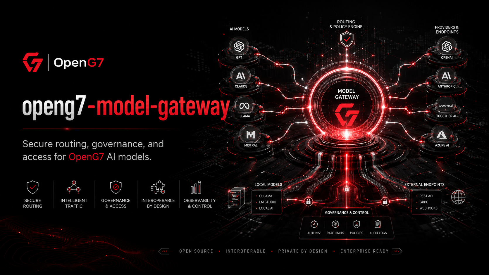

# OpenG7 Model Gateway

Secure, provider-neutral routing, governance and observability layer for AI models used across OpenG7.

## Workspace architecture

Target workspace architecture:

- `apps/model-gateway-api`: OpenAI-compatible and OpenG7-native inference endpoints.
- `apps/model-gateway-admin`: provider, route, quota and model approval interface.
- `packages/model-domain`: model, provider, route, capability and residency contracts.
- `packages/model-routing`: policy-aware routing and fallback logic.
- `packages/model-providers`: adapters for local and explicitly approved external providers.
- `packages/model-redaction`: input classification, minimization and redaction pipeline.
- `packages/model-observability`: latency, token, cost, error and route traces.
- `packages/model-sdk`: typed client for OpenG7 applications and agents.

## Local-first approach

Prefer registered local or jurisdiction-approved models whenever they meet the task requirements.

Route selection should consider:

- task capability
- data classification
- jurisdiction and residency
- model approval status
- context length
- latency and availability
- cost budget
- evaluation score
- required tool or structured-output support

Do **not** send protected data to an external provider merely because a local route is unavailable. Fail closed or request an approved exception.

## Provider guidance

Every provider adapter must declare:

- supported models and capabilities
- data processing location
- retention and training terms
- authentication method
- maximum context and output size
- streaming and tool-call support
- health and rate-limit behavior
- cost accounting fields
- audit metadata

External provider terms must be reviewed outside the codebase and represented in the AI registry.

## Routing guidance

Routes should be explicit and versioned:

```text
north-mini-code/default
north-mini-code/open-g7-adapter
embedding/multilingual-local
vision/document-local
external/general-approved
```

Applications should request a capability or approved route alias rather than hard-code a provider URL.

## Reuse in other projects

Use shared packages:

- `@openg7/model-domain`
- `@openg7/model-sdk`
- `@openg7/model-routing`
- `@openg7/model-redaction`

Provider-specific SDKs should remain internal to the gateway.

## OpenG7 example configuration

Initial sovereign code route:

- Route: `north-mini-code/default`
- Provider: local vLLM or SGLang deployment
- Jurisdiction: `CA`
- Data classification: public and internal code approved by policy
- Tool calls: enabled
- Streaming: enabled
- External fallback: disabled
- Audit: required
- Evaluation minimum: configured through the model registry

## Commands

The initial workspace is expected to expose the following commands:

```bash
corepack enable
yarn install
yarn lint
yarn format
yarn format:check
yarn test
yarn build
yarn docs
```

Commands may evolve with the implementation, but CI should preserve equivalent lint, test, build, and documentation gates.


## Production launch

Use `docs/production-launch-checklist.md` before applications depend on the gateway.

The initial production deployment should expose one local model route and one local embedding route. Automatic external fallback, cross-border routing and provider-based prompt logging should remain disabled.

## Model Gateway module (V1)

### Environment variables

- `MODEL_GATEWAY_ENV` — `development`, `test`, or `production`.
- `MODEL_GATEWAY_ALLOWED_ORIGINS` — allowed browser origins.
- `MODEL_GATEWAY_DATABASE_URL` — private PostgreSQL connection string for routes and usage state.
- `MODEL_GATEWAY_IDENTITY_ISSUER` — trusted OpenG7 Identity issuer.
- `MODEL_GATEWAY_POLICY_ENGINE_URL` — required production policy decision endpoint.
- `MODEL_GATEWAY_AI_REGISTRY_URL` — optional approved-model registry endpoint.
- `MODEL_GATEWAY_AUDIT_ENDPOINT` — production audit event sink.
- `MODEL_GATEWAY_DEFAULT_ROUTE` — safe default route alias.
- `MODEL_GATEWAY_EXTERNAL_FALLBACK_ENABLED` — must default to `false`.
- `MODEL_GATEWAY_REQUEST_TIMEOUT_MS` — upstream timeout.
- `MODEL_GATEWAY_MAX_INPUT_TOKENS` — global safety ceiling.
- `MODEL_GATEWAY_MAX_OUTPUT_TOKENS` — global safety ceiling.
- `MODEL_GATEWAY_USAGE_RETENTION_DAYS` — usage metadata retention period.
- `MODEL_GATEWAY_PROMPT_LOGGING_ENABLED` — must default to `false`.
- `MODEL_GATEWAY_REDACTION_MODE` — `off`, `observe`, or `enforce`.
- `MODEL_GATEWAY_ENCRYPTION_KEY` — protects stored provider credentials and sensitive route state.

Provider credentials should use provider-specific secret variables or a secret manager and must never appear in route responses.

### Local launch

```bash
docker compose --profile database up -d postgres
corepack yarn dev
```

Verify configured providers:

```bash
corepack yarn models:verify
```

List effective routes:

```bash
corepack yarn routes:list
```

### Private PostgreSQL

Recommended initial tables:

- `model_providers`
- `model_definitions`
- `model_routes`
- `model_route_versions`
- `model_credentials`
- `model_usage_events`
- `model_health_events`
- `model_policy_exceptions`

Encrypt provider credentials and keep database access private.

### OpenAI-compatible endpoint

Initial compatibility endpoints:

```text
POST /v1/chat/completions
POST /v1/responses
GET  /v1/models
POST /v1/embeddings
```

Compatibility endpoints must still enforce OpenG7 identity, policy, route and audit rules.

### OpenG7 native endpoint

```text
POST /api/model/inference
POST /api/model/embeddings
POST /api/model/rerank
GET  /api/model/routes
GET  /api/model/routes/:routeId
```

The native request may include:

- requested capability
- preferred route
- data classification
- jurisdiction
- purpose
- repository or project scope
- latency or cost budget
- required structured-output schema

The gateway remains responsible for selecting the effective provider and model.

### Route administration

```text
GET  /api/admin/model/providers
POST /api/admin/model/providers
POST /api/admin/model/providers/:providerId/verify
GET  /api/admin/model/routes
POST /api/admin/model/routes
POST /api/admin/model/routes/:routeId/publish
POST /api/admin/model/routes/:routeId/disable
GET  /api/admin/model/usage
GET  /api/admin/model/health
```

Route publication should require validation and authorized approval.

### Routing decision

A routing trace should record:

- requested capability and route
- candidate models
- policy decision
- data classification and jurisdiction
- selected model and provider
- fallback decisions
- model and adapter version
- latency, usage and result status

Do not retain full prompt content by default.

### Redaction and minimization

Before external transmission, the gateway may apply:

- secret detection
- personal-information detection
- repository path minimization
- identifier tokenization
- field-level removal
- prompt size reduction

Redaction is not a substitute for policy authorization. A denied transmission remains denied.

### Rate limits and quotas

Support limits by:

- organization
- user
- agent
- application
- route
- model
- time window
- cost or token budget

Critical OpenG7 services may receive reserved local capacity, but not unrestricted bypasses.

### Health and fallback

Fallback must be:

- explicitly configured
- capability-compatible
- policy-compatible
- residency-compatible
- visible in the routing trace

Never fall back from an approved local route to an unapproved external provider.

### Usage reporting

Expose aggregate operational reporting:

```text
GET /api/admin/model/usage
GET /api/admin/model/usage/by-route
GET /api/admin/model/usage/by-organization
GET /api/admin/model/health
```

Usage reports should avoid exposing prompt content or private application data.

## Security principles

- local-first routing
- external fallback disabled by default
- provider allowlists
- encrypted credentials
- no prompt logging by default
- policy decision before protected transmission
- strict route versioning
- bounded context and output
- usage and health auditability
- immediate route revocation

## Integration with OpenG7

- `openg7-identity` — authenticates callers and service accounts.
- `openg7-ai-policy-engine` — authorizes route and data transmission.
- `openg7-knowledge-core` — uses approved embedding and reranking routes.
- `openg7-agent-runtime` — performs agent inference through stable route aliases.
- `openg7-ai-evals` — supplies model quality and safety thresholds.
- `openg7-mini-code-lab` — publishes candidate Mini Code adapters and artifacts.

## Initial roadmap

### V1

- local provider adapter
- route aliases
- OpenAI-compatible chat and embeddings
- identity and policy checks
- usage metrics
- health checks

### V2

- multiple providers
- policy-aware fallback
- redaction pipeline
- cost and quota controls
- registry integration

### V3

- federated model gateways
- confidential inference adapters
- cryptographically signed model routes
- workload-aware GPU scheduling

## License and governance

The gateway should remain open, interoperable and provider-neutral. Provider integrations must document licensing, privacy, retention, residency and commercial constraints without presenting external services as sovereign by default.
